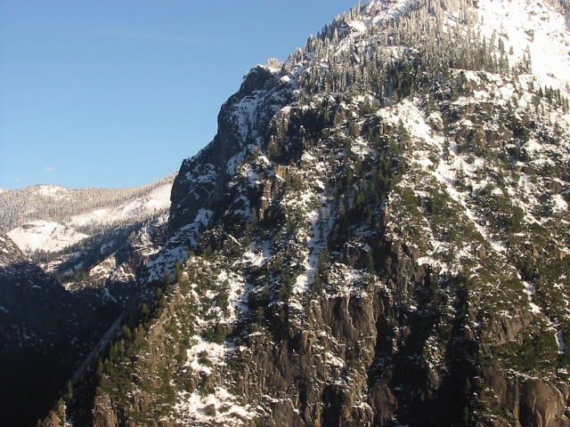

# Panoramic Mosaicing

### Steps to Run Locally on your System
1. `git clone https://github.com/trunc8/panoramic-mosaicing.git`
2. `pip install -r requirements.txt`

### Usage
1. Stitching two images: 
```
$ cd panoramic-mosaicing/
$ python3 code/pano-auto.py <path-to-directory-containing-2-images>
(e.g.) python3 code/pano-auto.py data/auto/campus/
```
2. Generalized mosaicing of 'n' images:
```
$ cd panoramic-mosaicing/
$ python3 pano-general.py <path-to-directory-of-images> <index-to-reference-image>
(e.g.) python3 code/pano-general.py data/general/mountain/ 3
```

### Demo
**Example-1**  
Input Images
<p align="center"> 
{:height="100px"}
{:height="100px"}
{:height="100px"}
{:height="100px"}
</p>
Panorama Mosaic Image
<p align="center"> 
{:height="200px"}
</p>

**Example-2**  
Input Images
<p align="center"> 
{:height="100px"}
{:height="100px"}
{:height="100px"}
{:height="100px"}
{:height="100px"}
</p>
Panorama Mosaic Image
<p align="center"> 
{:height="200px"}
</p>

**Example-3**  
Input Images
<p align="center"> 
{:width="200px"}
{:width="200px"}
</p>
Panorama Mosaic Image
<p align="center"> 
{:width="400px"}
</p>

### Authors

* **Siddharth Saha** - [trunc8](https://github.com/trunc8)

<p align='center'>Created with :heart: by <a href="https://www.linkedin.com/in/sahasiddharth611/">Siddharth</a></p>